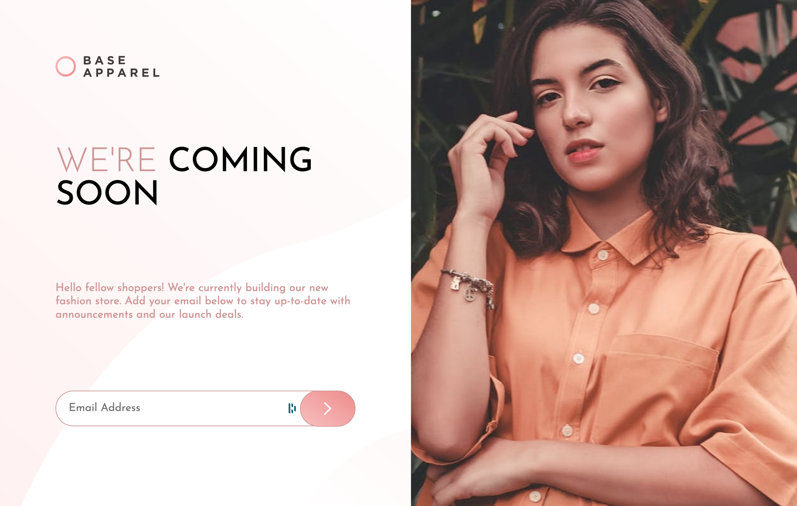
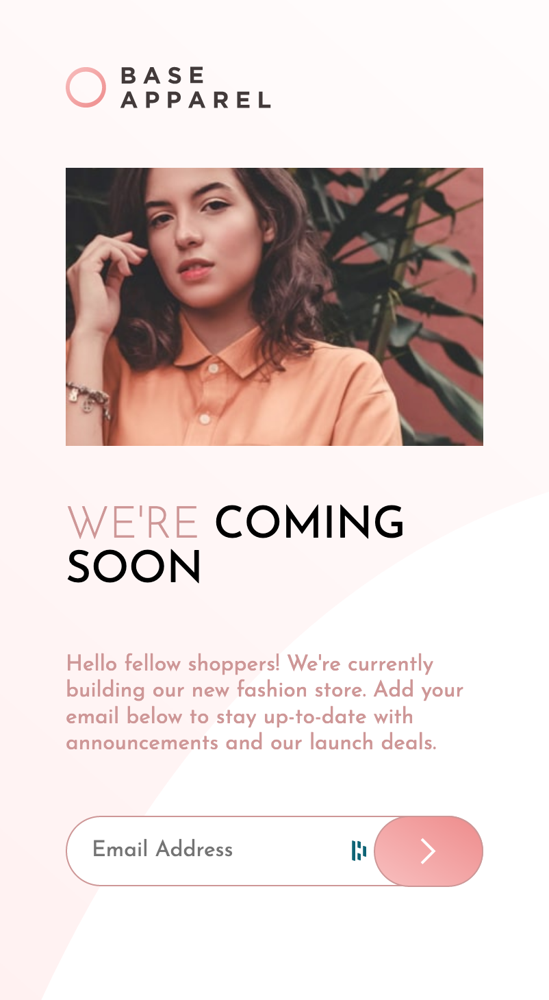

# Frontend Mentor - Base Apparel coming soon page


## Welcome! 👋

Thanks for checking out this front-end coding challenge.

[Frontend Mentor](https://www.frontendmentor.io) challenges allow you to improve your skills in a real-life workflow.

**To do this challenge, you need a basic understanding of HTML, CSS and JavaScript.**

## Links

[Demo](https://master--resplendent-bombolone-4e5f90.netlify.app/)

### Built with

- Semantic HTML5 markup
- CSS
- Flexbox

### What I learned

I used the pseudo css class `:invalid` to display the email error message


```html
<div class="form-group">
  <input type="email" placeholder="Email Address"/>
  <button type="submit" class="btn">
    
  </button>
  <span class="error-message">Please provide a valid email</span>
</div>
```

```css
.error-message {
    visibility: hidden;
    font-weight: 300;
    margin-left: 1rem;
    margin-top: 1rem;
    color: hsl(var(--soft-red));
}
input:invalid ~ .error-message {
    visibility: visible;
}
```

## Screenshot

|  |   |
|-----------------------------------------------------------------|----------------------------------------------------------------|
